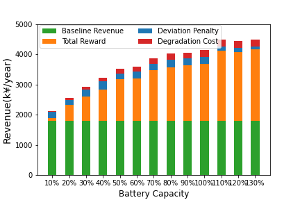
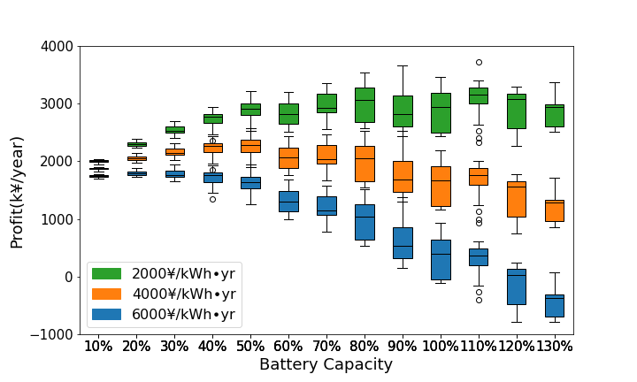
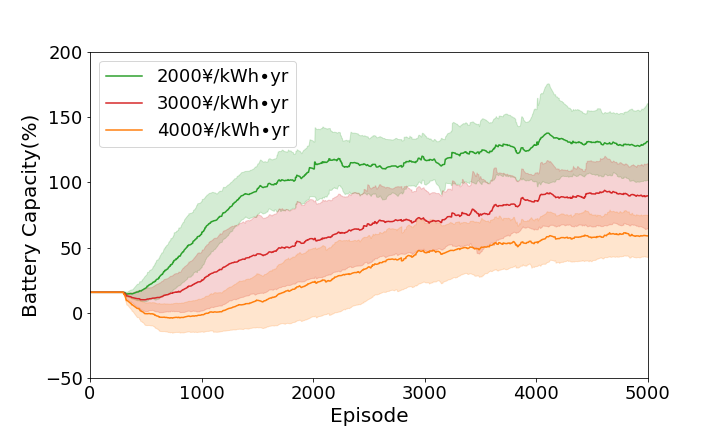
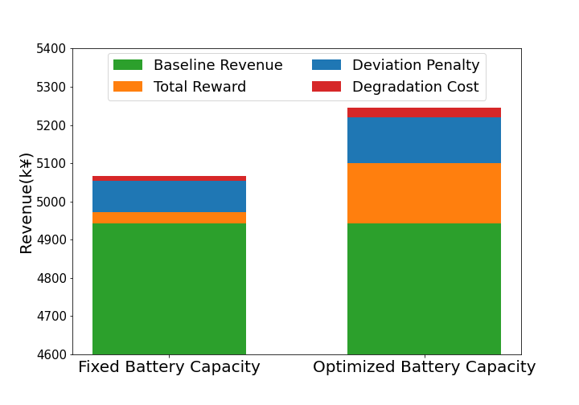

# Optimization-RE-and-battery-capacity-using-DRQN

Python implementation of "Renewable Energy Bidding and Battery Size Co-optimization Using Reinforcement Learning". 

## Training of Standard DRQN agent

1. Training of a single DRQN agent for each BESS size setting:
   ```console
    ./main_drqn_multiple.py
   ```
1. Training of multiple DRQN agents in parallel:
   ```console
    ./main_drqn_multiple.py
   ```

<div align=left> 


</div>


## Co-design (Verification Using Short-term Data)

1. Training of a single co-design agent:
   ```console
    ./main_codesign_drqn.py
   ```
1. Training of multiple co-design agents in parallel:
   ```console
    ./main_codesign_drqn_multiple.py
   ```

<div align=left> 

</div>

## Co-design (Applicability to Long-Term Data)

1. Training of co-desing agent with parallel workers:
   ```console
    ./main_codesign_drqn_apex.py
   ```

<div align=left> 

</div>

